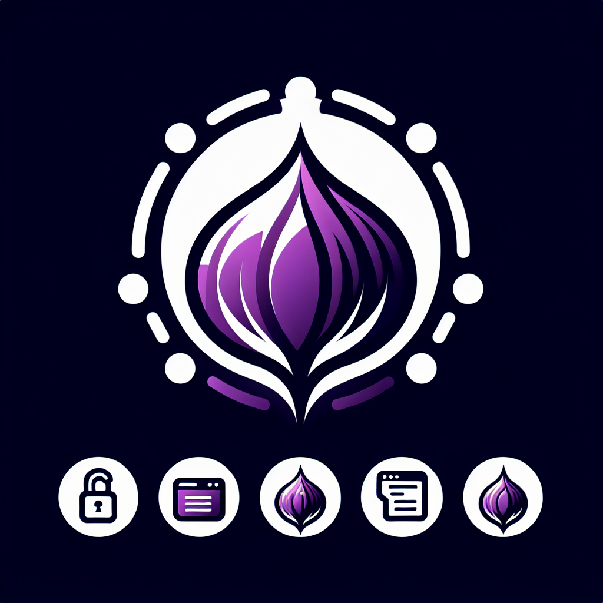

  

# TorCord

This is a multi-language project that utilizes Python, and Java. The project is built with Maven.

## About
This is a school project and was originally going to use spring boot for the API but decided to use FastAPI instead. Even though this was suppoed to be a Java project FastAPI is something that I have been wanting to learn and I think has more application to my future projects. The project is a chat application that is similar to Discord.

## Challenges 
The hardest part of the project was to get the server to talk to the client. I ended up using a websocket to keep a constant connection going and only sending messages to the client when a new msg is sent to the server. The way that it was done, it had to call the whole database every instance. It would be more efficient to use a redis server to keep track of new messages.

## Getting Started

These instructions will get you a copy of the project up and running on your local machine for development and testing purposes.

### Prerequisites

What things you need to install the software and how to install them:

- Python
- Java Development Kit (JDK)
- Maven
- MariaDB or MySQL Server (Use [Docker](https://hub.docker.com/_/mariadb))

### Installing

A step by step series of examples that tell you how to get a development environment running:

1. Clone the repository to your local machine.
2. Install the prerequisites.
3. Build the project using Maven.
4. Run fast API using Python.

## Features

- [x] Chat
- [ ] Send Images
- [ ] React to Messages
- [ ] Voice Chat
- [ ] Video Chat
- [ ] File Sharing
- [ ] Screen Sharing
- [ ] Channel Creation
- [ ] Channel Management

## Deployment

Not yet available.

## Built With

- [Python](https://www.python.org/)
- [Java](https://www.oracle.com/java/)
- [Maven](https://maven.apache.org/)

## Authors

- **RoundDoor** - *Initial work* - [RoundDoor](https://github.com/rounddoor)

## Goals

- [ ] Build out a better looking GUI 
- [ ] Complete the full feature set.
- [ ] Make the API and DB run on a P2P network.

## License

This project is licensed under the MIT License - see the [LICENSE.md](LICENSE.md) file for details
